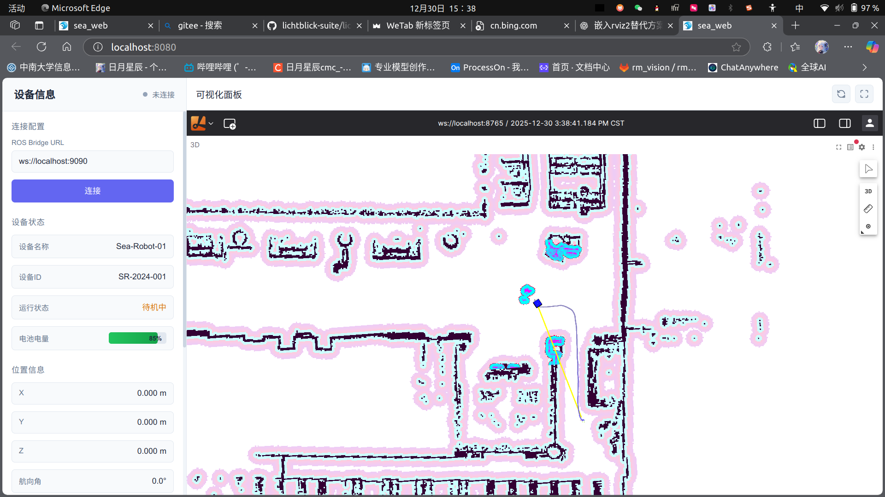

[TOC]

# sea_web

海恒智能导航底盘管理终端，对接sea_slam仓库中的所有ROS2话题服务接口

> 目标：所有3D导航车共用一套代码


# 项目关键点

- 利用[foxglove翻版开源](https://github.com/lichtblick-suite/lichtblick)，将foxglove栅格地图界面缝合到web中
- 使用roslibjs库，直接订阅/发布ros2话题消息

# 预览



## 一、项目结构

```bash
```

## 二、开发环境

### 1.基础

- node v20.19.6
- pnpm 10.26.2

### 2.安装

```bash
pnpm install
```

## 三、运行开发

```bash
pnpm run serve
```

格式检查

```bash
pnpm run lint
```

## 编译构建

```bash
pnpm run build
```