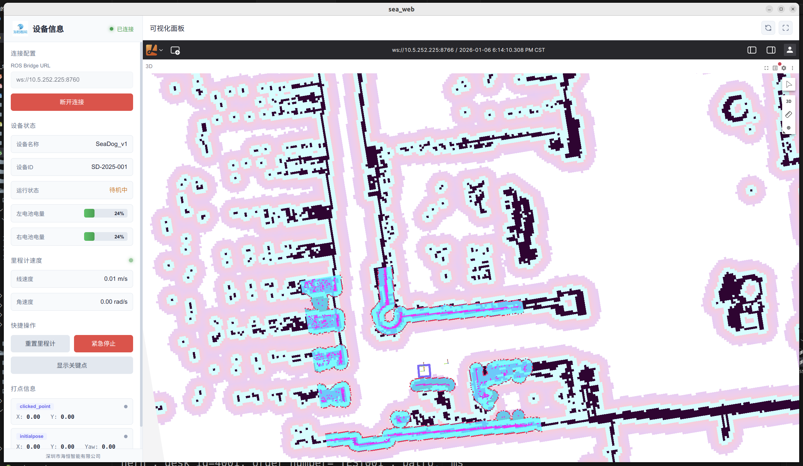
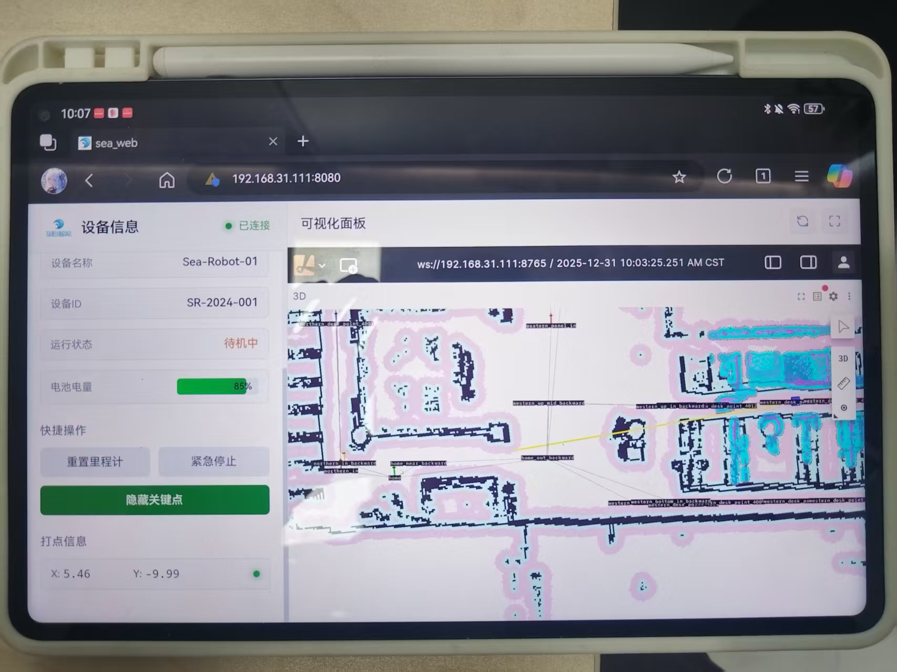

[TOC]

# sea_web

海恒智能导航底盘管理终端，对接 ROS2 话题服务接口

**目标：所有3D导航车共用一套代码**


# 项目关键点

- 利用[foxglove翻版开源](https://github.com/lichtblick-suite/lichtblick)，将foxglove三维地图界面缝合到web中，实现快速开发
- foxglove_bridge添加topic白名单，使用`ros2 param list /foxglove_bridge`查看参数
- 使用roslibjs库，前端代码直接订阅/发布ros2话题消息，只保留少量的http请求

# 预览

|桌面客户端|web网页端|
|---|---|
|  |  |

# 使用说明

客户端软件使用说明请参考文档[使用说明(中文)](./src/assets/guide_cn.md)

## 一、关键项目结构

```bash
sea_web
├── desktop                       (electron打包配置)
│
├── public
│   └── lichtblick/.webpack       (foxglove yarn 构建)
│
└── src
    ├── assets
    ├── components
    │   ├── DevicePanel.vue       (设备信息面板)
    │   ├── KeyposesViewer.vue    (航点可视化面板)
    │   ├── NodeEditDialog.vue    (航点编辑对话框)
    │   └── LichtblickViewer.vue  (foxglove面板)
    └── config
        └── index.js              (参数文件)
```

## 二、开发环境

### 1.基础

- node v20.19.6
- pnpm 10.26.2
- nginx

### 2.安装

```bash
pnpm install
```

## 三、运行开发

> 注意本项目引用的lichtblick开源，是有经过修改的，要提前把布局约束好，不用让用户调布局

```bash
pnpm run serve
```

格式检查

```bash
pnpm run lint
```

## 四、编译构建

### 1. Web 部署（Nginx）

```bash
pnpm build
```

安装使用Nginx部署

```bash
sudo apt install nginx -y
sudo systemctl start nginx      # 启动 Nginx
sudo systemctl enable nginx     # 设置开机自启

sudo rm /var/www/html/*.html    # 清除默认欢迎界面html

sudo cp -r dist/* /var/www/html
sudo systemctl restart nginx
```

访问机器人ip即可，默认80端口

### 2. 桌面客户端打包（Electron）

支持 Windows 和 Linux 平台。

#### 安装依赖

首次使用需安装 Electron 依赖：

```bash
pnpm install
# 如果 Electron 二进制未下载，手动执行：
cd node_modules/.pnpm/electron@28.3.3/node_modules/electron && node install.js
```

#### 打包命令

```bash
# 开发模式运行
pnpm electron:serve

# 打包 Linux 版本 (AppImage + deb)
pnpm electron:build:linux

# 打包 Windows 版本 (需要 wine 或在 Windows 系统上)
pnpm electron:build:win

# 同时打包 Linux 和 Windows
pnpm electron:build:all
```

#### 输出位置

打包后的安装包位于 `dist_electron/` 目录：
- Linux: `Sea-AI-x.x.x.AppImage`、`sea-ai_x.x.x_amd64.deb`
- Windows: `Sea-AI Setup x.x.x.exe`

#### 注意事项

- 在 Linux 上打包 Windows 版本需要安装 `wine`，不推荐这样做
- 窗口配置：默认全屏，最小尺寸 1200×800，无菜单栏
- 暂时不考虑支持安卓
