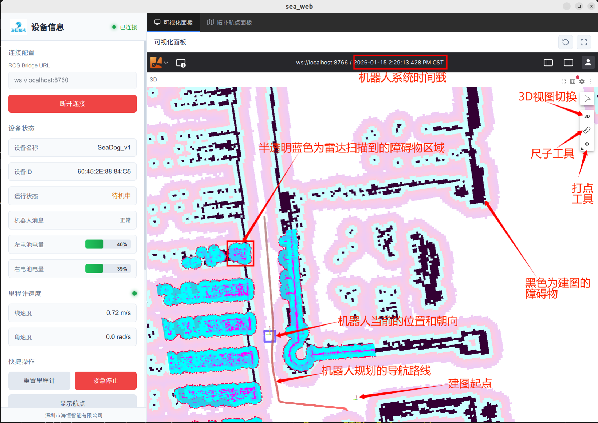
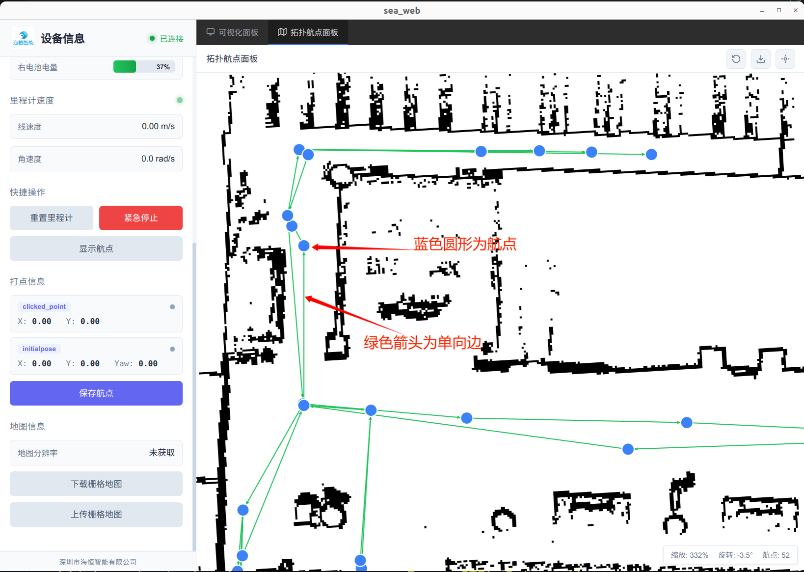
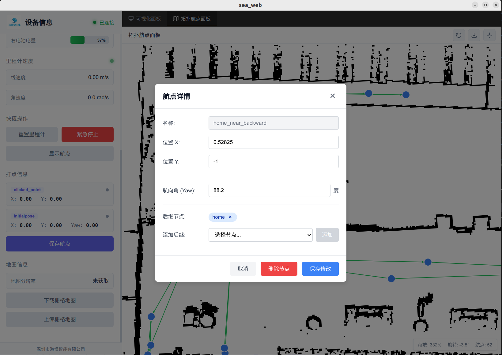

[TOC]

# 使用说明

> 最终解释权归深圳市海恒智能有限公司所有

## 连接配置

首先要确保电脑客户端和海恒导航机器人在同一个局域网下，并且已知机器人ip地址

1. 在左侧设备信息面板，设置`ROS Bridge URL`为ws://{机器人ip}:8760，点击连接(也有自动连接功能)

2. 右侧可视化面板打开时，点击`Open connection` > 选中`Foxglove WebSocket` > 输入`WebSocket URL`为ws://{机器人ip}:8766 > 点击`Open`，等待片刻后右侧可视化面板可以看到机器人导航地图和机器人位置

## 导航可视化面板

- **机器人系统时间戳：** 可以通过观察机器人系统时间戳有没有及时更新判断客户端可视化面板有没有卡顿

- **半透明蓝色为雷达扫描到的障碍区域：** 机器人会用3D雷达扫描周边环境，识别障碍物区域，通常机器人导航会避开这些扫描到的障碍物

- **机器人当前的位置和朝向：** 紫色边框为机器人的实体大小，里面还有一个坐标系朝向，代表机器人的正方向

- **机器人规划的导航路线：** 红色的曲线为机器人自主路径规划的路线，机器人路径规划会按照用户规定的导航拓扑节点路径规划

- **建图起点：** **机器人开机必须要到建图起点附近执行初定位，反向和起点方向一样**，否则可能出现机器人初定位不准

- **黑色为建图的障碍物：** 用户可以通过这个障碍物判断机器人所在的场景是否对应

- **3D视图切换：** 用户可以点击这个按钮，切换查看机器人导航的3D视图和2D的俯视图

- **尺子工具：** 点击可以拿出来测量地图中的距离

- **打点工具：** **长按**打点工具，从上往下选择第一个`Publish pose estimate`，使用带偏航角yaw方向的打点

## 快捷操作

- **重置里程计：** 当机器人出现定位故障时，用户要将机器人遥控开回导航起点，点击重置里程计重定位。**其他情况禁止点击重置里程计**

- **紧急停止：** 用户可以点击客户端的急停按钮，效果和停障相同

- **显示航点：** 点击按钮，可以在右侧可视化面板上看到所有航点和其航点名称

## 打点信息

通过右侧打点工具打点(一定要切换成带方向的打点工具)在目标位置点上后，左侧打点信息面板会显示相对应的xy坐标和yaw朝向

> 如果没有显示，一定要点击右上角刷新按钮刷新重试，如果还是不行关闭客户端重开

点击保存航点，用户可以设置航点名称，注意航点名称最好用英文且不能重复

## 地图信息

1. 点击`下载栅格地图`按钮，地图信息面板会显示当前使用的地图分辨率，通常是0.1m/px

2. 将下载好的pgm格式的栅格地图，可以通过P图软件进行P图，在想要的区域画上黑色障碍物，或者把异常黑色障碍涂成白色表示可通行区域

3. 点击`上传栅格地图`按钮，将修改好的pgm格式地图上传，机器人重启开机生效

## 拓扑航点面板

- **蓝色圆形为航点：** 用户可以点击蓝色圆形修改航点信息，点击右上角刷新航点按钮查看更改

- **绿色箭头为单向边：** 代表机器人只能从前一个航点到下一个节点，如果为双向边则为双向箭头

